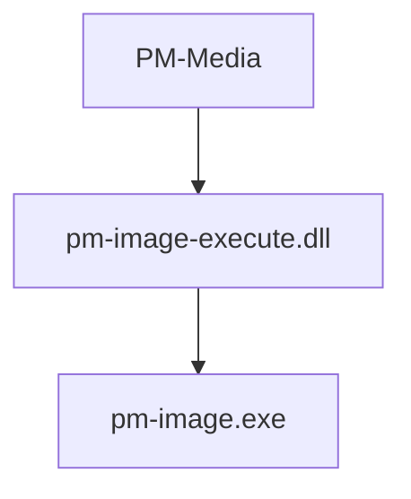

# Windows Explorer integration (PM-Image)

The default is **COM in‑process** (`pm-image-execute.dll`): **`IExecuteCommand`** + **`IObjectWithSelection`**, with **per‑CLSID** payload in **`HKCU\Software\PolyMech\pm-image\IExecuteMap\`**. A **`PM-Media` cascade** menu under file types and **`Directory`** (not **`Directory\Background`** for the heaviest “Presets” block—see `register_explorer.cpp`).

## What gets registered

Everything is under **`HKEY_CURRENT_USER`** (no admin). Logging: `%APPDATA%\PolyMech\pm-image\register-explorer.log`.

| Artifact | Role (default) |
|----------|------------------|
| `pm-image.exe` | `register-explorer` and the child process for all verbs |
| `pm-image-execute.dll` | In‑proc COM: reads selection, spawns `pm-image.exe` with the right subcommands |
| `IExecuteMap\<GUID>\` + `CLSID\<GUID>\InprocServer32` | Written by **`pm-image`**, not by `regsvr32` — one CLSID per **logical** verb (shared across all file-assoc targets) |
| **Open with** (ProgId, **`Applications\<exe>\SupportedTypes`**, **`App Paths`**, **`…\Capabilities`**, **`OpenWithProgids`**, **`Explorer\FileExts\.ext\OpenWithList`** a–z + MRU, **`MuiCache`**) | **Register:** `pm-image resize --ui-next --src "%1"`. Also seeds Explorer’s per-extension `OpenWithList` so the app can appear in the **short** “Open with” list. **Retry:** re-run `register-explorer` after changes; if needed restart Explorer. **Unregister** removes the Capabilities subtree and `MuiCache` value; other `PolyMech\pm-image\` keys stay. |

## CLI: `pm-image register-explorer`

| Option | Purpose |
|--------|--------|
| *(default)* | **COM** (`IExecuteCommand`) for resize (all `--widths`), convert, open UI, meta, chat, and every transform preset. Requires **`pm-image-execute.dll`** next to `pm-image.exe`. |
| `--group`, `--widths`, `--media-bin`, `--dry`, `--no-refresh-shell` | Menu group label, resize width list, path to `pm-image.exe`, print-only run, skip `SHChangeNotify`. |
| `--unregister` | Removes shell keys for the group, then calls **`reg_cleanup_user_entries()`** (clears `IExecuteMap`, manifest CLSIDs, and a few **legacy** fixed CLSIDs from older builds). |

**Reference:** [IExecuteCommand](https://learn.microsoft.com/en-us/windows/win32/api/shobjidl_core/nn-shobjidl_core-iexecutecommand).

**Code:** `pm_image_iexecute.cpp`, `pm_iexecute_map.*`, `pm_iexecute_reg.cpp`, `register_explorer.cpp`.

## Behavior (default COM)

1. On register, **`reg_cleanup_user_entries()`** then **`build_delegate_table`**: for each **unique** command (all resize width×2, convert, open UI, meta, chat, each **transform preset**), **`CoCreateGuid`**, write **IExecuteMap** (Kind, width, preset, …) and **InprocServer32** to the DLL path.
2. The same braced string is set as **`DelegateExecute`** for every `SystemFileAssociations\…\shell\…\command`, **`Directory\…\shell\…\command`**, and **`Directory\Background\…\shell\…\command`** (resize / convert / meta / open UI only on background — no Chat / Presets cascade there).
3. The DLL’s **`Execute()`** expands folders to image files, then spawns `pm-image.exe` (resize, convert, `resize --ui-next`, `meta`, `transform`, etc.).

## Presets: Chat and transform

Under **“Presets”** (nested **`pm_aichat`**) registration uses **the same** COM `DelegateExecute` entries as the flat verbs: **Chat** and each **transform preset** get their own **Kind** in the map (`Chat` / `Transform` + `Preset` string).

## Auto‑registration after build

| Cache option | Default | Meaning |
|----------------|---------|--------|
| `MEDIA_AUTO_REGISTER_EXPLORER` | `OFF` in dev presets | When `ON`, post‑build runs `pm-image register-explorer` from `dist\`. |

**`npm run build`** → `cmake --build --preset release` (see `package.json`).

## Uninstall

```text
pm-image register-explorer --unregister
```

## Quick mental model (default)



## Third-party file manager hosts (e.g. Altap Salamander)

`pm-image-execute.dll` is built with the **static** CRT (**`/MT`**) on MSVC so in-process **STL** does not bind to an **older** `MSVCP140.dll` shipped by the host (a common cause of access violations in `MSVCP140.dll` when the same DLL works in Explorer). Re-run **`pm-image register-explorer`** after replacing the DLL.

## See also

- [win11.md](win11.md) — roadmap: **IExplorerCommand** + **package identity** for the Windows 11 *primary* Explorer menu (separate from default `IExecute` today)
- `package.json` — `npm run build` → `cmake --build --preset release`
