# `--ui-next` Win32++ Ribbon UI — Architecture Reference

Launched via `pm-image resize --ui-next`.  
No lib/CLI processing runs inline — the UI owns its own message pump and dispatches work to background threads, posting `UWM_*` messages back to the UI thread.

---

<a id="user-guide-ui-next"></a>

## User guide (`--ui-next`)

**Launch**

```bash
pm-image resize --ui-next
pm-image resize --ui-next photo1.jpg path\to\more\
```

Optional **positional paths** or **`--src`** entries pre-fill the **file queue**. Requires a **Windows** build with the Win32++ UI enabled.

**Ribbon (Home → Actions)** — five mode-switch buttons + a single **Run** button. Clicking an Action button only **switches the Settings panel mode**; the work runs when you click **Run** (or press the QAT default).

**Ribbon (Home → Batch)** — three buttons that control the running batch:

| Button | When enabled | Effect |
|---|---|---|
| **Pause** | Batch running, not paused | Worker blocks after the current file; partial session state saved to `m_currentSession` |
| **Resume** | Batch paused | Unblocks the worker |
| **Cancel** | Batch running | Worker exits loop; partial state available for Save Session |

**Ribbon (Home → Session)** — explicit session persistence (see [docs/queues.md](queues.md)):

| Button | When enabled | Effect |
|---|---|---|
| **Save Session** | `m_currentSession` non-empty | Writes session to `sessions.json` (`%APPDATA%\PolyMech\pm-image\`) |
| **Load Session** | Always | Opens a modal list of saved sessions; restores queue + settings mode; `error` items become `Pending` for retry |

- **Resize** — **Resize settings** (dimensions, fit, kernel, output folder / naming). Run applies **`media::resize_file()`** to queued paths (or Explorer selection — those files are added to the queue first).
- **Compress** — **Compress settings** (MozJPEG vs PNG, quality, PNG level, strip metadata; quantize / zopfli when supported by the build). Run applies **`media::compress_file()`**.
- **Meta** — **Meta settings** (outputs `.md` / `.json` / EXIF, in-memory pre-resize, provider / model, prompt presets). Run applies **`media::meta_extract()`**.
- **Transform** — **Transform settings** (prompt, provider, aspect, model, **reference images**). Run applies **`media::transform_image()`** with the same queue / selection rules and any attached references.
- **Find** — **Find settings** (search query, **`Use LLM`** toggle, name-mode toggles, LLM cache toggles, model / resize-width, max results, **reference images**). Run calls **`media::find_images()`**; matches stream into the dockable **Find Results** panel.

**Panels / View** — **Queue**, **Log**, **Resize settings** (main Settings dock), **File info**, **Find results**, **Chat**, **Explorer**, **Nodes** (when enabled): visibility is toggled from the main **`View`** menu (checkmarks follow dock state). The ribbon strip itself carries **Home** actions (file ops, mode switches, batch, session) plus **Reset layout**, **Debug**, **App settings** — see **`FEATURE_USE_OWN_RIBBON`** in §1 below for the split versus the stock Windows Ribbon host.

**Panels (typical layout)**

| Panel | Purpose |
|-------|---------|
| **Queue** | Input list; resize / compress / transform / meta report status here. |
| **Settings** | Current mode: resize, compress, meta, transform, or **find** options. |
| **Log** | Human-readable progress and errors (includes input/output paths on failure). |
| **Preview** | Large preview; pan, mouse wheel zoom, touch gestures; **Fit** / **Full**; RAW fast preview then optional full decode. Renders text and Markdown sidecars too. |
| **File info** | Metadata for the loaded image. |
| **File tree** | Optional (`FEATURE_FILETREE`): embedded **`IExplorerBrowser`** — **Details** view; default is list-only (no Shell frames). **View → App Settings** can enable **full Shell UI** (**`EBO_SHOWFRAMES`**: address bar, navigation tree, command rows). That chrome may stay light in a dark app theme. See **File tree — shell host**. **Backspace** / **Delete** as below. |
| **Find Results** | Tabbed alongside the Queue (hidden until first search). One row per match with name, score, source (`name`/`folder`/`md`/`json`/`exif`/`llm`), reason, and full path. Click → preview. Right-click → reveal in the Explorer panel, open in Windows Explorer, copy path, remove. **Del** removes selected rows. **Double-click** opens the file with its default app. |

**Preview shortcuts**

- **F11** or **Alt+F** — Toggle fullscreen (window chrome off, maximized on monitor).
- **Esc** — Exit fullscreen.

**App-wide shortcuts**

- **Alt+P** — *Take screenshot.* Captures the on-screen pixels under the main window via `BitBlt(SRCCOPY | CAPTUREBLT)` from the screen DC, encodes PNG with GDI+, and writes `<cwd>/screenshots/pm-image-YYYYMMDD-HHMMSS.png`. The folder is created on demand. Status bar and Log show the saved path. (Same surface as `pm-image app takescreenshot` — see **App commands** below.) The hotkey is claimed in `CMainFrame::PreTranslateMessage` rather than `WM_SYSKEYDOWN` so it works regardless of which dock has focus and isn't shadowed by the Windows Ribbon Framework's KeyTip handling. EDIT / RICHEDIT focus is detected and the keys fall through so typing into the chat input / inline rename / find boxes is unaffected. Every invocation logs `[app] running command: takescreenshot` to the Log dock on entry, then either `[app] screenshot saved: <path>` or `[app] screenshot failed: <reason>`. **HiDPI:** the capture flips the calling thread to `DPI_AWARENESS_CONTEXT_PER_MONITOR_AWARE_V2` for the duration of the BitBlt (RAII, restored on scope exit, resolved dynamically via `GetProcAddress` so the binary still loads on pre-Windows-10-1607 systems). Without that override, on >100% scaled displays `GetWindowRect` returns logical pixels while the screen DC is in physical pixels, and the bitmap captures only the upper-left fraction of the window. **Frame bounds:** the bounds come from `DwmGetWindowAttribute(DWMWA_EXTENDED_FRAME_BOUNDS)`, not `GetWindowRect`. Since DWM composition was added (Vista+) `GetWindowRect` includes the invisible drop-shadow / resize-grab margin around the chrome — capturing that rect drags in the desktop background under those margins and the PNG ends up with a grey halo around the actual window. `DWMWA_EXTENDED_FRAME_BOUNDS` returns the visible chrome only. Falls back to `GetWindowRect` when DWM composition is disabled (legacy classic theme).

**Find Results — interactions**

- **Click a row** → preview the matched image, update the File Info panel, set status bar to the file name.
- **Double-click a row** → open the file in its default Windows app.
- **Right-click**: *Reveal in Explorer panel* (navigates the in-app `IExplorerBrowser` to the file's folder), *Show in Windows File Explorer* (`explorer /select,`), *Open*, *Copy path*, *Remove from results*.
- **Del** → remove the selected rows from the result list.
- A search **clears the previous results**, brings the panel to the front, and streams new matches in.

**File tree — shell host (`IExplorerBrowser`)**

By default, `CExplorerBrowserView::InitBrowser` uses **`FVM_DETAILS`** **without** **`EBO_SHOWFRAMES`**, so you only get the list (and column headers). The browser is always created with **`EBO_NOWRAPPERWINDOW`** and **`EBO_NOBORDER`** so Shell does not add an extra wrapper window or an inner border—embedding matches the dock client. Optional **`EBO_SHOWFRAMES`** adds lighter-themed Shell chrome; see below.

Optional **full Explorer chrome** (address bar, navigation pane, Shell “Layout”/command rows) is available: enable **Explorer panel: full Shell UI** in **View → App Settings**, or set **`window.filetree_show_shell_frames`** to **`true`** in `settings.json`. The control is recreated with `GetOptions`/`SetOptions(EBO_SHOWFRAMES)`; the last folder is restored. Shell-internal pane visibility is still managed by Explorer inside the embed, not separately by pm-image.

The **`filetree_folder`** key still mirrors the last browsed path for startup.

**File tree — interactions**

- **Click a file** → preview it; the file becomes the implicit target for the next Run.
- **Backspace** → navigate to the parent folder (`IExplorerBrowser::BrowseToIDList(nullptr, SBSP_PARENT)`). No-op at the root (e.g. *This PC*).
- **Delete** / **Shift+Delete** → move the selected files to the Recycle Bin via `IFileOperation` with `FOFX_RECYCLEONDELETE | FOF_ALLOWUNDO`. The standard Shell confirmation dialog is shown (no silent deletes). Just before invoking the Shell op the dock synchronously sends `UWM_RELEASE_PREVIEW_FOR_PATHS` to the frame, which clears the central preview (`CFileViewer::ClearPicture / ClearText / ClearMarkdown`). The 250 ms selection poll re-loads the new selection automatically.
- The image preview itself loads bytes via `SHCreateMemStream` + `Gdiplus::Image::FromStream` rather than `Gdiplus::Image::FromFile`. `FromFile` memory-maps the file and keeps an OS file handle open for the lifetime of the `Image*`, which makes Shell delete / rename / external-edit ops silently fail with a sharing violation on the previewed file. With the in-memory variant the file handle closes the moment the read finishes; the `IStream*` is held alongside `m_pImage` (in `m_imgStream`) and released together via `DropImageAndStream()`. Trade-off: the entire encoded image lives in our address space until a `Clear*` / mode-switch — fine for typical photos, and large RAW files already go through the libvips pipeline which decodes once to a heap Bitmap.
- **RAW preview pipeline** (`FEATURE_RAW_PREVIEW` / `FEATURE_RAW_VIEW`) uses two background threads — Stage 1 fast `vips_thumbnail` (~50–300 ms, embedded JPEG when available) and Stage 2 full `vips_image_new_from_file` Bayer decode (~1–3 s). Both threads are **vips-only**: they fill a heap-allocated `std::vector<unsigned char>*` with `vips_jpegsave_buffer` JPEG bytes and `PostMessage(UWM_RAW_PREVIEW_READY / UWM_RAW_DECODED, bytes, gen)`; the **UI thread** then wraps the bytes in `SHCreateMemStream` + `Gdiplus::Image::FromStream`. Workers never touch GDI+, so they can be safely detached on rapid navigation without racing `Gdiplus::GdiplusShutdown` in `~CFileViewer`. Each launched worker captures a `std::shared_ptr<std::atomic<bool>>` cancel flag; `CancelRawThreads(false)` (navigation) flips the flag and detaches, `CancelRawThreads(true)` (destructor) joins so libvips' GLib type system isn't yanked mid-call. `vips_image_new_from_file` is uncancellable inside libvips, so a late cancel only saves the post-decode work — the CPU spent in vips itself is sunk, but the app no longer crashes on rapid navigation. Generation counters (`m_rawFastGen` / `m_rawGeneration`) are kept as defence-in-depth: any race-past-cancel buffer that lands in the WndProc is dropped by the gen check and `delete bytes`.
- The keys are handled in `CExplorerBrowserView::PreTranslateMessage` (called by `CMessagePump::PreTranslateMessage` walking up `msg.hwnd`'s parent chain). Subclassing the inner `SysListView32` directly is unreliable — `IExplorerBrowser` can recreate the listview on navigation, and the dock client may not hold focus on it. `PreTranslateMessage` runs in the message pump *before* `DispatchMessage`, so it catches keys for descendants of this view (file list, column header, dock chrome). EDIT / RICHEDIT focus is detected and keys fall through for inline rename fields.

**Theme & font** (View → **App Settings**)

- **Theme**: `System` (follows Windows `AppsUseLightTheme`), `Light`, `Dark`. Dark mode applies `DWMWA_USE_IMMERSIVE_DARK_MODE` to the title bar, `UseDarkMenu`, **per-control** `SetWindowTheme` (`DarkMode_Explorer` for most controls; **`COMBOBOX` uses `DarkMode_CFD` in dark** so the field and list paint dark — `DarkMode_Explorer` on combo leaves a white field), **optional** rounded client clip on combo + single-line edit via `SetWindowRgn` (see [win32xx-next.md](win32xx-next.md)), themed colours in `WM_CTLCOLOR*`, dark Markdown CSS. Light theme: combo uses `Explorer` / `CFD` as in `helpers/theme.cpp`. With the **stock UIRibbon** host (`FEATURE_USE_OWN_RIBBON` off), **ApplyAppearance** also pushes an HSB tint via `IUIFramework` / `UI_PKEY_Global*` on the Quick Access command (the ribbon DLL is closed-source — only a grey-ish tint). With the **own ribbon** strip (see §1), the toolbar uses `NMTBCUSTOMDRAW` + `SetWindowTheme` and tracks `pmui::theme_palette()` directly; owner-drawn **View** popups use `SetMenuTheme` + `CMainFrame::DrawMenuItemBkgnd` so rows match `control_bg` instead of pure black. The **system menu bar** (File / Actions / …) is still OS-drawn; immersive dark mode is best-effort by OS build.
- **Font size**: `Default` (system message font, Segoe UI 9pt) or `+1 / +2 / +3 / +4 pt`. **Default ship value is `+2 pt`**. Applied live to every dock panel and dialog (no restart) via `pmui::ui_font()` + `pmui::apply_font_to_tree(panel)` in `ApplyAppearance()`.

Both settings persist under `appearance` in `settings.json` next to provider keys / window layout.

**Display languages (resource packs)** — `en` (default), `es`, `de`, `it`, `fr`: ribbon and fallback menu strings ship as multilingual Win32 resources (`src/win/ui_next/locales/*.rc`); the OS UI language selects which block loads (English when none match). In-app locale override and runtime string strategy are still evolving—see [docs/i18n.md](i18n.md).

**Persistence**

- **`%APPDATA%\PolyMech\pm-image\settings.json`** — Window placement, panel visibility (incl. **`findresults`**), File tree folder + **`window.filetree_show_shell_frames`**, AI presets / provider storage, **`appearance.theme` + `appearance.font_size_extra_pt`** (format may be encrypted PME1 or JSON).
- **Registry** — `Polymech\pm-image-ui`: Win32++ dock topology (splitter sizes, dock vs float). On conflict, JSON panel visibility is applied after registry restore so **closed panels stay closed** across restarts.

**Build flags** (see `src/win/ui_next/features.h`) control Explorer, Nodes workbench, RAW preview tiers, PNG compressor extras, and optionally the **own ribbon** strip (`FEATURE_USE_OWN_RIBBON`) versus the stock **Windows Ribbon Framework** host.

**App commands** (external interface — Windows only)

A small, named verb surface that the running pm-image UI accepts from outside callers. Today it's invoked by:

- **In-app keyboard shortcuts** — e.g. `Alt+P` for `takescreenshot` (see **App-wide shortcuts** above).
- **CLI** — `pm-image app <verb>` from any shell (or shortcut, scheduled task, hotkey daemon, …). Sends the verb to the running primary instance over `WM_COPYDATA` and exits. If no primary UI is running, the CLI prints an error and returns non-zero.

| Verb | What it does | Default destination |
|------|---------------|---------------------|
| `takescreenshot` | Captures the main window's on-screen pixels to PNG. | `<cwd>/screenshots/pm-image-YYYYMMDD-HHMMSS.png` (created on demand) — will move to `%APPDATA%\Polymech\pm-image\screenshots\` once the rest of the app commits to that path. |

Plumbing:

- `src/win/app_commands.{hpp,cpp}` — verb enum + name parser + screenshot folder/filename helpers. Add new verbs here.
- `src/win/screenshot.{hpp,cpp}` — `capture_window_to_png(hwnd, out_path, err)` using `GetDC(NULL)` + `BitBlt(SRCCOPY | CAPTUREBLT)` and `Gdiplus::Bitmap::Save` with the PNG encoder CLSID. GDI+ is started up locally per call.
- `src/win/ui_singleton.{hpp,cpp}` — the `WM_COPYDATA` bridge gained a second channel (`dwData == 2`): payload is a UTF-8 verb name. The bridge wraps it in `new std::string(...)` and `PostMessage`s it to the registered command target. Old `dwData == 1` (resize-UI path-merge for the legacy `--ui` dialog) is unchanged.
- `launch_ui_next.cpp` — best-effort `try_acquire_ui_singleton_mutex()` + `create_ui_singleton_bridge()` on startup; if another primary already holds the mutex, we still launch a UI but skip the bridge so external commands always reach a single primary. RAII-cleaned on exit.
- `CMainFrame::OnInitialUpdate` — registers the frame's HWND as the bridge target with `set_ui_command_target(GetHwnd(), UWM_APP_COMMAND)`.
- `CMainFrame::OnAppCommand` (`UWM_APP_COMMAND`) — unwraps the `std::string*`, deletes it, and dispatches via `RunAppCommand(name)`. The same `RunAppCommand` is what `Alt+P` calls directly, so external + in-app shortcut paths converge on a single switch on the parsed `Command` enum.
- `WM_CLOSE` clears the target with `clear_ui_command_target()` so a late-arriving `pm-image app …` doesn't post to a destroyed HWND.

**Adding a new verb** (one-page checklist):

1. Add a value to `media::win::app_cmd::Command` and update `parse()` / `name()` in `src/win/app_commands.cpp`.
2. Handle the new value in the `switch` in `CMainFrame::RunAppCommand` (`Mainfrm.cpp`) — log success / failure to the Log dock.
3. (Optional) Add a `WM_SYSKEYDOWN` arm in `CMainFrame::WndProc` for an in-app shortcut.
4. Add a `pm-image app <verb>` subcommand in `src/main.cpp` next to `app_screenshot_cmd`, set the `verb` string in the dispatch arm.
5. Update this section + the `pm-image app --help` row in `README.md`.

Below: **developer-oriented** architecture (components, sequences, data flow).

---

## 1. Component Overview

```mermaid
graph TB
    subgraph exe["pm-image.exe"]
        main["main.cpp\nCLI11 parse"]
        launch["launch_ui_next()\nobjbase / CoInitialize"]
        app["CPmImageApp\n: CWinApp"]
        frame["CMainFrame\n: CRibbonDockFrame\nor CDockFrame (own)"]
    end

    subgraph ribbon["Ribbon host / assets"]
        xml["Ribbon.xml"]
        bml["Ribbon.bml (binary)"]
        rh["RibbonUI.h (generated)"]
        own["OwnRibbonTab +\nOwnRibbonLayout\nCPager + CToolBar"]
    end

    subgraph panels["Dock Panels"]
        queue["CDockQueue\nCQueueListView"]
        log["CDockLog\nCLogView"]
        settings["CDockSettings\nCSettingsView\n(MODE_RESIZE/COMPRESS/META/\nTRANSFORM/FIND)"]
        fileinfo["CDockFileInfo\nCFileInfoView"]
        genpreview["CDockGenPreview\nCFileViewer\n(image / text / md)"]
        findres["CDockFindResults\nCFindResultsView\n(tabbed with Queue;\nhidden until 1st search)"]
        filetree["CDockFileTree ①\nCExplorerBrowserView\n(IExplorerBrowser)"]
        nodes["CDockNodes ②\nCNodesView\n(DX11 + ImGui)"]
    end

    subgraph appearance["Appearance"]
        appdlg["AppSettingsDlg\n(modal: theme + font)"]
        themehlp["helpers/theme.hpp\npmui::theme_palette()\nenable_app_dark_mode\napply_window_theme_recursive\napply_dark_titlebar"]
        fonthlp["helpers/ui_font.hpp\npmui::ui_font()\nui_font_init_from_settings\napply_font_to_tree"]
    end

    subgraph persist["Persistence"]
        reg["Win32 Registry\nDock topology\n(sizes, parents, floating)"]
        json["settings.json\nappearance: theme + font_extra_pt\nPanel visibility (incl. findresults)\nWindow placement\nExplorer folder\nAI presets / Provider keys"]
    end

    subgraph workers["Background workers (std::thread)"]
        resize_w["Resize / Compress / Meta\nworkers"]
        transform_w["AI Transform worker\nmedia::transform_image()"]
        find_w["Find worker\nmedia::find_images()"]
    end

    subgraph core["pm-media static lib"]
        resize_lib["core/resize.hpp"]
        transform_lib["core/transform.hpp"]
        meta_lib["core/meta.hpp"]
        find_lib["core/find.hpp\n(LLM judge + reference imgs)"]
        settings_store["win/settings_store\n(providers, window, appearance)"]
    end

    main -->|"--ui-next flag"| launch
    launch --> app
    launch -->|"ui_font_init_from_settings\ntheme_init_from_settings\nenable_app_dark_mode"| appearance
    app -->|"Create()"| frame
    frame -.->|"UIRibbon host\nIUIApplication"| bml
    frame -.->|"own strip\nWM_COMMAND"| own
    rh -.->|"IDs + BMPs"| own
    xml -->|"uicc.exe"| bml
    xml -->|"uicc.exe"| rh
    frame --- queue & log & settings & fileinfo & genpreview & findres
    frame -. "FEATURE_FILETREE" .-> filetree
    frame -. "FEATURE_NODES" .-> nodes
    frame -->|"OnInitialUpdate / OnAppSettings\nApplyAppearance()"| appearance
    appdlg -->|"save_appearance"| json
    frame -->|"WM_CLOSE\nSaveDockRegistrySettings"| reg
    frame -->|"WM_CLOSE\nsave_window_layout"| json
    reg & json -->|"OnInitialUpdate\nLoadLayout"| frame
    frame -->|"std::thread"| resize_w & transform_w & find_w
    resize_w -->|"PostMessage UWM_QUEUE_DONE\nUWM_COMPRESS_DONE\nUWM_META_DONE"| frame
    transform_w -->|"PostMessage UWM_TRANSFORM_DONE\nUWM_GENERATED_FILE"| frame
    find_w -->|"PostMessage UWM_FIND_PROGRESS\nUWM_FIND_DONE"| frame
    resize_w --> resize_lib & meta_lib
    transform_w --> transform_lib
    find_w --> find_lib
    find_lib -.uses.-> meta_lib
    settings_store --- json
```

> **Frame base:** `FEATURE_USE_OWN_RIBBON` → `CMainFrame : CDockFrame` + child strip; otherwise `CRibbonDockFrame` + `IUIApplication`. **Docks:** `FEATURE_FILETREE` (default ON), `FEATURE_NODES` (opt-in).

---

### 1a. `FEATURE_USE_OWN_RIBBON` (optional CMake toggle)

CMake: **`-DFEATURE_USE_OWN_RIBBON=ON`** (`CMakeLists.txt` `option` + `FEATURE_USE_OWN_RIBBON=1` on the `pm-image` target). Documented in **`src/win/ui_next/features.h`**.

When enabled, the frame inherits **`Win32xx::CDockFrame`** only (no `UIRibbon.dll` host). A child **`COwnRibbonTab`** (`OwnRibbonTab.cpp` / `OwnRibbonLayout.cpp`) hosts **`CPager` + `CToolBar`** with bitmaps from the same **uicc-generated** `RibbonUI.h` resource IDs (`IDC_*_LargeImages_RESID`). Commands bubble as **`WM_COMMAND`** and route through **`CMainFrame::RunRibbonCommandId`** (mirrors stock **`Execute`** routing, without `IUIFramework`).

| Topic | Behaviour |
|-------|-----------|
| **ReBar / menu band** | **`UseReBar(FALSE)` + `UseToolBar(FALSE)`** run in **`CMainFrame`’s constructor** *before* `CDockFrame::OnCreate`. If these flags were flipped only in `OnCreate`, Win32++ would already have created a **ReBar + `CMenuBar`** band — the own strip at client `(0,0)` would overlap it (menu text and toolbar on the same row; hover glitches). With ReBar disabled, the frame uses a normal **`SetMenu`** menu bar; the strip sits on the first row of the **client** area below it. |
| **Layout build** | **`BuildRibbonLayout()`** runs **after** `Create` succeeds (not from `WM_CREATE`), so `ApplyLayout` failures do not return `-1` from `OnCreate` with useless `GetLastError()`. On failure, **`own_ribbon::LastRibbonLayoutErrorW()`** surfaces in a message box. |
| **Strip height** | **`PreferredHeight()`** uses **`COwnRibbonToolStrip::MeasuredStripHeight()`** (toolbar intrinsic height after `Autosize`) plus **`RibbonChromeTopInset`**, **`RibbonChromeBottomInset`** (both DPI-scaled, equal), and **`RibbonChromeBottomRule`** (1 device px minimum hairline). **`COwnRibbonChromePage`** paints the strip background + bottom rule (`caption_pen`) and positions the pager below the top inset (`OwnRibbonTab.cpp`). |
| **Pager** | **`ForwardMouse(FALSE)`** on the pager avoids horizontal “jumping” when clicking near overflow arrows. |
| **View toggles** | Panel visibility commands **`IDC_CMD_VIEW_*`** live on the main **View** menu (`Resource.rc`); **`SyncViewMenuChecks()`** keeps checkmarks in sync. The strip does not duplicate those buttons (narrower strip, less overflow). |
| **Menus (dark)** | **`ApplyAppearance`** sets **`MenuTheme`** from **`pmui::theme_palette()`** (flat gutter, accent selection) and **`CMainFrame::DrawMenuItemBkgnd`** uses **`control_bg`** instead of Win32++’s hard-coded `#000` for dark owner-drawn rows. **`::DrawMenuBar`** forces a redraw after theme changes. |

**`GetViewRect()`** excludes the full **`m_ownRibbon`** rectangle so **`RecalcDockLayout`** receives a `GetViewRect()` whose top edge is **below** the ribbon chrome (dock client does not sit under the strip).

---

## 2. Source File Map

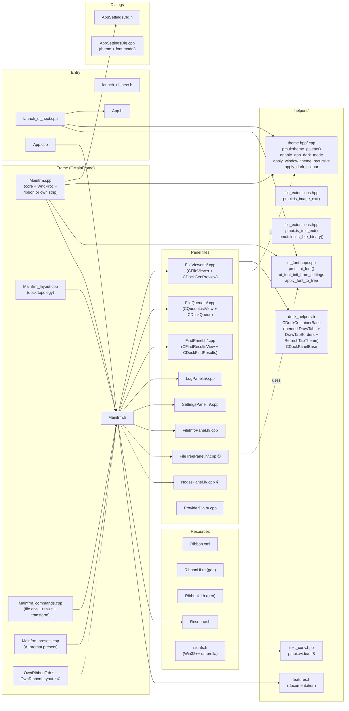

> ① Present when **`FEATURE_USE_OWN_RIBBON`** is enabled at CMake configure time (`CMakeLists.txt` option + `target_compile_definitions` on `pm-image`).

---

## 3. Dock Hierarchy (default layout)

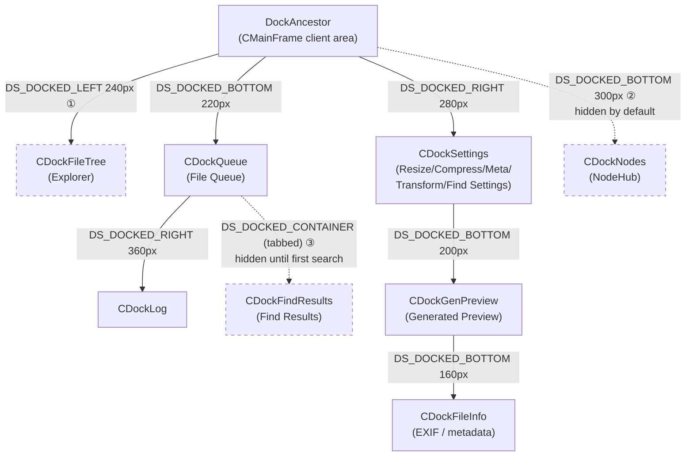

> ① requires `FEATURE_FILETREE`  
> ② requires `FEATURE_NODES`, always starts hidden  
> ③ Find Results is **tabbed alongside the Queue** (`DS_DOCKED_CONTAINER`); the View tab toggle re-opens it after closing

---

## 4. Startup Sequence

```mermaid
sequenceDiagram
    participant main as main.cpp
    participant launch as launch_ui_next
    participant app as CPmImageApp
    participant frame as CMainFrame
    participant registry as Win32 Registry
    participant json as settings.json

    main->>launch: launch_ui_next — initial_files
    launch->>launch: CoInitializeEx — apartment-threaded
    launch->>launch: vips_init — GLib type system on main thread
    launch->>launch: pmui::ui_font_init_from_settings
    launch->>launch: pmui::theme_init_from_settings
    launch->>launch: pmui::enable_app_dark_mode
    note over launch: uxtheme ord 135 — must precede first window
    launch->>app: CPmImageApp
    launch->>app: AddFilesToQueue — if any
    launch->>app: app.Run

    app->>frame: CMainFrame()
    note over frame: LoadPresets() from settings.json

    app->>frame: Create()
    frame->>frame: SetView(m_view)
    frame->>frame: LoadRegistrySettings("Polymech\\pm-image-ui")
    alt FEATURE_USE_OWN_RIBBON
        frame->>frame: CDockFrame::Create()
        frame->>frame: m_ownRibbon.Create + BuildRibbonLayout()
        note over frame: No UIRibbon; comctl pager + toolbar
    else stock ribbon host
        frame->>frame: CRibbonDockFrame::Create()
        note over frame: Ribbon loaded from Ribbon.bml
    end

    frame->>frame: OnInitialUpdate()  [via UWM_WINDOWCREATED]
    frame->>registry: LoadDockRegistrySettings()
    alt Registry restore OK
        registry-->>frame: Dock topology (parents, sizes, styles)
        frame->>frame: GetDockFromID() for each panel
    else Registry missing / stale
        frame->>frame: BuildDefaultDockLayout()
    end

    frame->>frame: Ensure optional panels exist
    frame->>frame: SetupDockContainers() (HideSingleTab)
    frame->>frame: StyleDocker() × all panels
    frame->>json: LoadLayout()
    json-->>frame: WindowPlacement
    json-->>frame: Panel visibility (window.panels)
    json-->>frame: filetree_folder
    frame->>frame: SetWindowPlacement()
    frame->>frame: ApplySavedPanelVisibility()
    frame->>frame: SetInitialFolder() on FileTreePanel

    frame->>frame: ApplyAppearance
    note over frame: 1. apply_dark_titlebar — DWM<br/>2. UseDarkMenu + SetMenuTheme (own strip)<br/>3. SetCaptionColors / SetBarColor per docker<br/>4. apply_font_to_tree per panel<br/>5. apply_window_theme_recursive — skips Win32++<br/>   classes + the IExplorerBrowser dock<br/>6. RefreshThemeColors on listviews<br/>7. RefreshTabTheme on containers<br/>8. UIRibbon: TintRibbonForTheme — HSB tint;<br/>   own strip: ApplyChrome + SyncViewMenuChecks

    note over frame: Message pump starts
    frame->>frame: WM_EB_INIT posted → IExplorerBrowser::Initialize
```

---

## 5. Ribbon Command Dispatch

**Own ribbon** (`FEATURE_USE_OWN_RIBBON`): toolbar / pager posts **`WM_COMMAND`** (or menu **`WM_COMMAND`** with `HIWORD==0`). **`CMainFrame::OnCommand`** calls **`RunRibbonCommandId`** for command IDs in the app’s ribbon range (~300–430); view-panel IDs also run **`RunViewPanelCommand`** / **`SyncViewMenuChecks`**. No `IUIFramework`.

With the **stock Windows Ribbon** host:

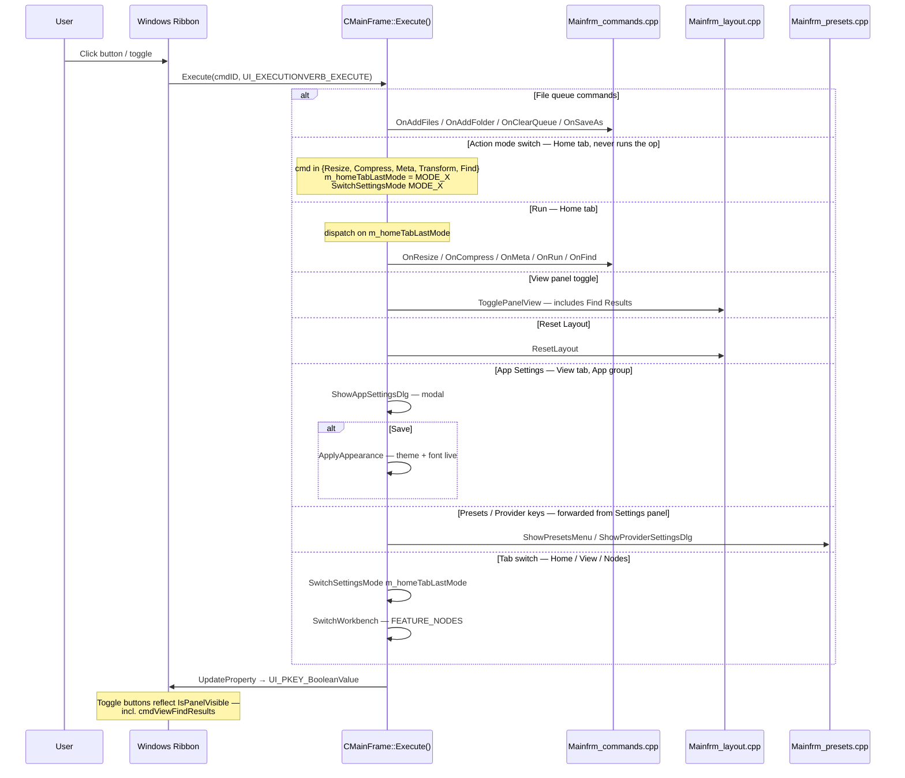

---

## 6. Resize Flow

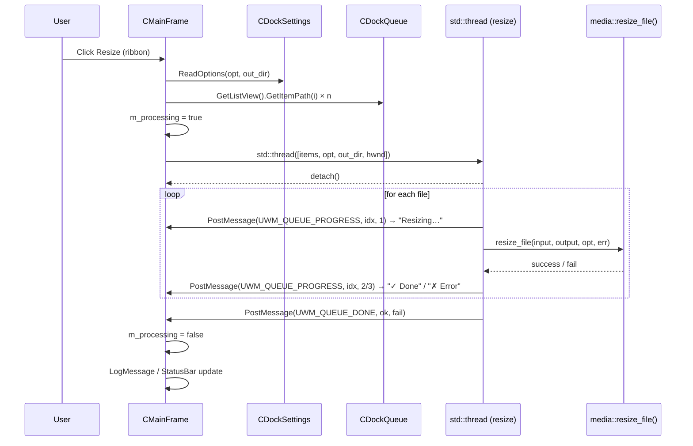

---

## 7. AI Transform Flow

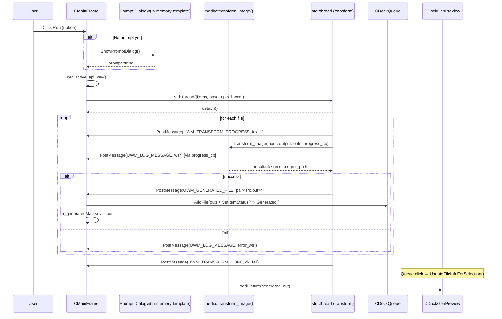

---

## 7b. Find Flow

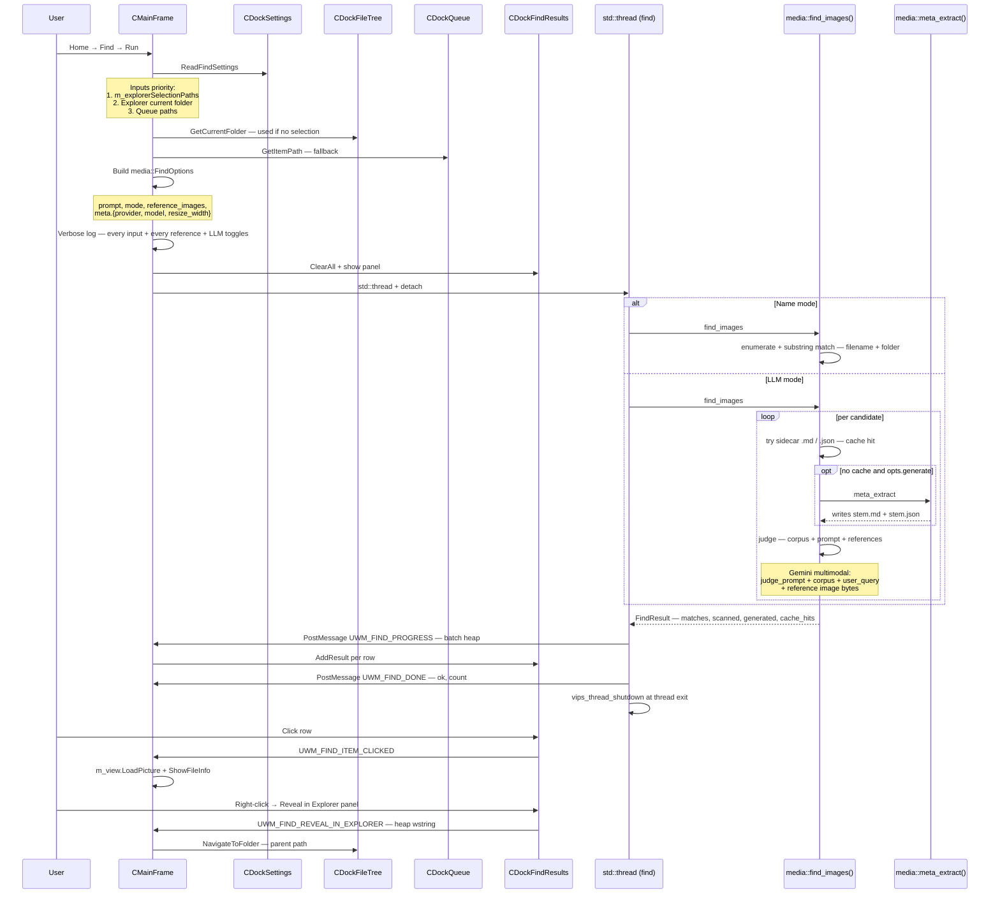

---

## 7c. App Settings (theme + font)

```mermaid
sequenceDiagram
    participant user as User
    participant frame as CMainFrame::Execute
    participant dlg as ShowAppSettingsDlg
    participant store as settings_store
    participant apply as CMainFrame::ApplyAppearance
    participant theme as helpers/theme
    participant font as helpers/ui_font

    user->>frame: View → App Settings
    frame->>dlg: ShowAppSettingsDlg
    dlg->>store: load_appearance
    store-->>dlg: AppearanceSettings{theme, font_size_extra_pt}
    user->>dlg: pick Theme + Font size, click Save
    dlg->>store: save_appearance
    note over store: merge into settings.json appearance key —<br/>libsodium PME1 + DPAPI key
    dlg-->>frame: IDOK

    frame->>apply: ApplyAppearance
    apply->>font: ui_font_init_from_settings — rebuild HFONT
    apply->>theme: theme_init_from_settings — refresh palette
    apply->>theme: apply_dark_titlebar — DwmSetWindowAttribute
    apply->>frame: UseDarkMenu
    apply->>theme: enable_app_dark_mode — process-level opt-in
    loop for each dock panel
        apply->>frame: SetCaptionColors / SetBarColor
        apply->>font: apply_font_to_tree
        apply->>theme: apply_window_theme_recursive
        note over theme: skips Win32++ classes;<br/>SetWindowTheme (dark: CFD on COMBO, Explorer else);<br/>optional SetWindowRgn; strips client edges
    end
    apply->>frame: RefreshThemeColors on listviews — Queue, Find Results
    apply->>frame: RefreshTabTheme on containers — SetBlankPageColor + repaint
    alt UIRibbon host
        apply->>frame: TintRibbonForTheme
        note over frame: UI_PKEY_Global* on cmdQAT
    else own ribbon strip
        apply->>frame: allow_dark_mode + apply_window_theme_recursive<br/>on m_ownRibbon; ApplyChrome; SyncViewMenuChecks;<br/>SyncBatchControls
    end
    apply->>frame: InvalidateRect
```

> The same flow is triggered automatically on `WM_SETTINGCHANGE("ImmersiveColorSet")` and `WM_THEMECHANGED` **only when the user is on the System theme** — explicit Light/Dark choices are sticky.

---

## 8. Persistence — Save (WM_CLOSE)

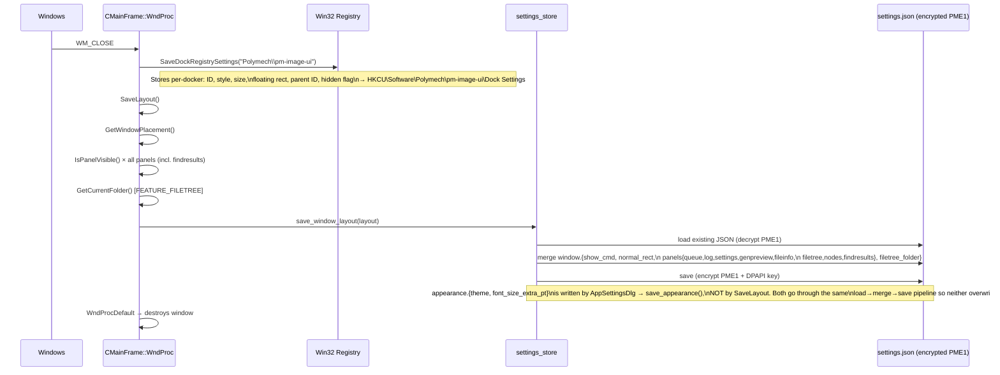

---

## 9. Persistence — Restore (OnInitialUpdate)

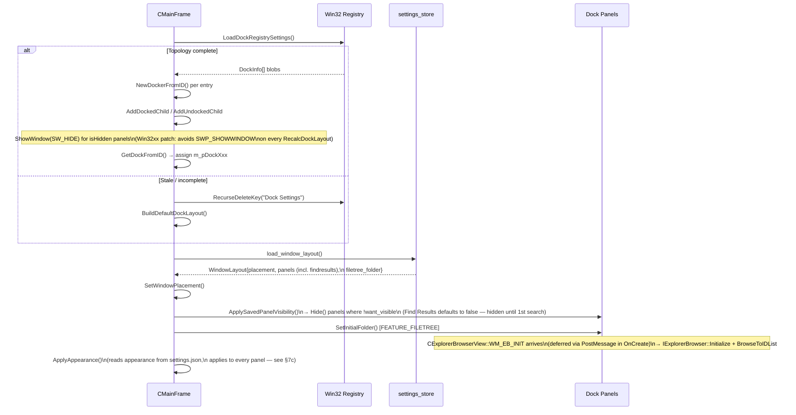

---

## 10. Panel Shell Pattern

Every dock panel follows this three-layer structure. Base classes from `helpers/dock_helpers.h` supply the standard `WndProc` try/catch so individual panels do not repeat it.

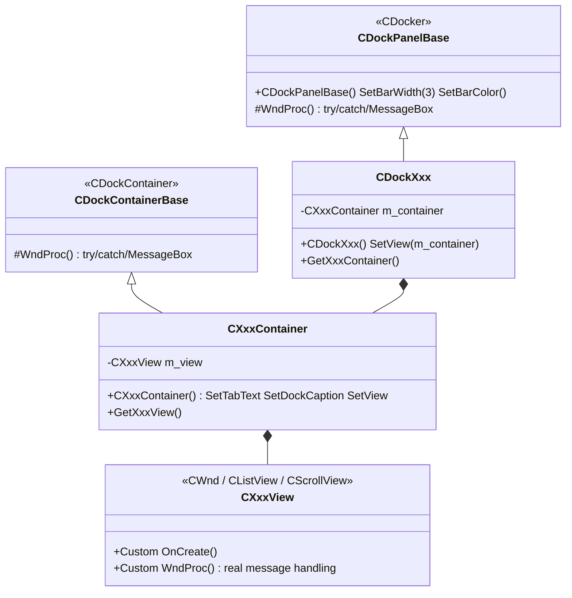

**Concrete panels**

| Docker | Container | View | Note |
|---|---|---|---|
| `CDockQueue`        | `CQueueContainer`        | `CQueueListView`        | Drag-drop, per-item status, **Del** removes |
| `CDockLog`          | `CLogContainer`          | `CLogView`              | Read-only multiline edit, themed bg |
| `CDockSettings`     | `CSettingsContainer`     | `CSettingsView`         | Modes: `RESIZE / COMPRESS / META / TRANSFORM / FIND` |
| `CDockFileInfo`     | `CFileInfoContainer`     | `CFileInfoView`         | EXIF via GDI+ |
| `CDockGenPreview`   | `CGenPreviewContainer`   | `CFileViewer`           | GDI+ scroll view; also renders **text** + **markdown** sidecars (embedded `IWebBrowser2` with light/dark CSS) |
| `CDockFindResults`  | `CFindResultsContainer`  | `CFindResultsView`      | Listview of `{name, score, source, reason, path}`; click → preview, right-click → reveal/open/copy/remove, Del → remove |
| `CDockFileTree` ①   | `CFileTreeContainer`     | `CExplorerBrowserView`  | `IExplorerBrowser` deferred init; **excluded from `apply_window_theme_recursive`** (Shell COM owns its children) |
| `CDockNodes` ②      | `CNodesContainer`        | `CNodesView`            | DX11 + Dear ImGui |

> ① `FEATURE_FILETREE` (default ON)  &nbsp; ② `FEATURE_NODES` (default OFF)

**Themed `CDockContainerBase`** — overrides `DrawTabs(CDC&)` and `DrawTabBorders(CDC&, RECT&)` to read colours from `pmui::theme_palette()` instead of Win32++'s hard-coded `RGB(248,248,248) / RGB(200,200,200) / RGB(160,160,160)`. Exposes `RefreshTabTheme()` which `CMainFrame::ApplyAppearance` calls to re-paint tabs after a theme switch.

---

## 11. Feature Flag Lifecycle

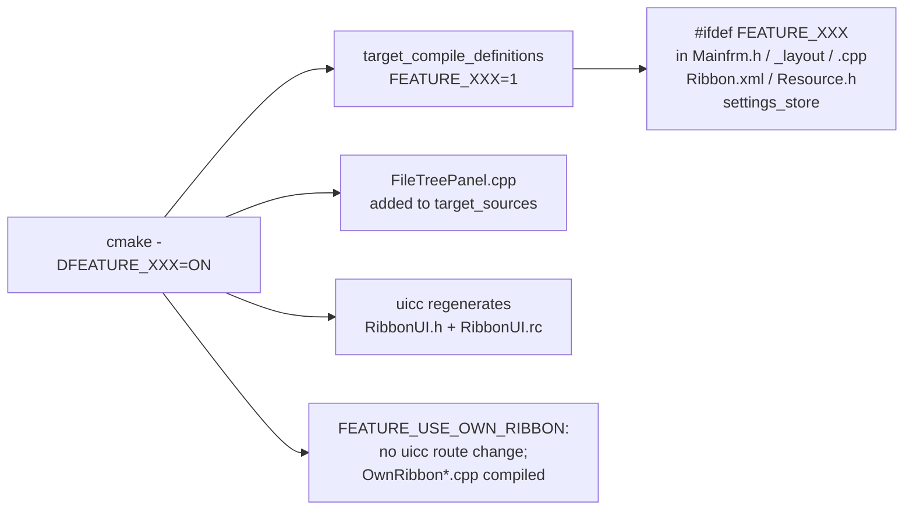

**Files touched when adding a new panel feature — checklist**

```
CMakeLists.txt          option() + target_compile_definitions + target_sources
features.h              documentation
Resource.h              IDC_CMD_VIEW_XXX  + UWM_<XXX>_* messages
Ribbon.xml              cmdViewXxx ToggleButton → re-run uicc;
                        bump cmdGroupPanels SizeDefinition by 1
MyPanel.h / .cpp        CDockContainerBase / CDockPanelBase pattern;
                        for listview-class panels add RefreshThemeColors();
                        consult pmui::ui_font() + pmui::theme_palette()
                        in WM_CTLCOLOR* / WM_ERASEBKGND
Mainfrm.h               DOCK_ID_XXX, CDockXxx* m_pDockXxx  (under #ifdef)
Mainfrm_layout.cpp      NewDockerFromID, SetupDockContainers,
                        BuildDefaultDockLayout, OnInitialUpdate,
                        ResetLayout, SaveLayout, ApplySavedPanelVisibility,
                        DebugDockState
Mainfrm.cpp             Execute() view toggle case, IsToggleSelected();
                        ApplyAppearance(): styleDocker, refreshPanel,
                        themePanel (skip if hosting Shell COM!),
                        RefreshThemeColors / RefreshTabTheme
settings_store.hpp      pv_xxx in WindowLayout
settings_store.cpp      load_window_layout / save_window_layout
```

**Adding a new Action (resize-style worker) — checklist**

```
src/core/<op>.{hpp,cpp}      worker + apply_<op>_options_from_json + buffer variant
                             (see docs/llm.md §3 for the full mechanical playbook)
SettingsPanel.{h,cpp}        MODE_<OP> + <Op>Settings struct + Read<Op>Settings
                             + controls into m_<op>Controls
Resource.h                   IDC_CMD_<OP>, IDC_<OP>_*, UWM_<OP>_*
Ribbon.xml                   cmd<Op> button on Home Actions group
                             (bump SizeDefinition: 5→6 buttons, etc.)
Mainfrm.{h,cpp}              On<Op>() decl; Execute() routes IDC_CMD_<OP>
                             to set m_homeTabLastMode + SwitchSettingsMode;
                             IDC_CMD_RUN dispatches MODE_<OP> → On<Op>()
Mainfrm_commands.cpp         On<Op>() worker thread (Explorer-selection-first
                             input rule; verbose log; vips_thread_shutdown
                             at thread exit)
```

---

## 12. Inter-thread Communication

The UI thread never blocks. Workers communicate back exclusively via `PostMessage`.

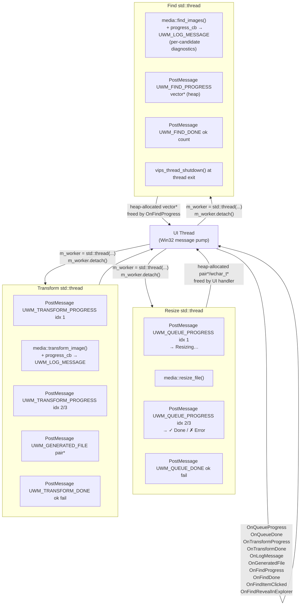

> **Heap ownership rule**:
> - `UWM_LOG_MESSAGE` carries a `new wchar_t[]` — freed by `OnLogMessage`.
> - `UWM_GENERATED_FILE` carries a `new pair<wstring,wstring>` — freed by `OnGeneratedFile`.
> - `UWM_FIND_PROGRESS` carries a `new vector<FindRow>` — freed by `OnFindProgress`.
> - `UWM_FIND_REVEAL_IN_EXPLORER` carries a `new wstring` — freed by `OnFindRevealInExplorer`.

---

## 13. Settings Storage Architecture

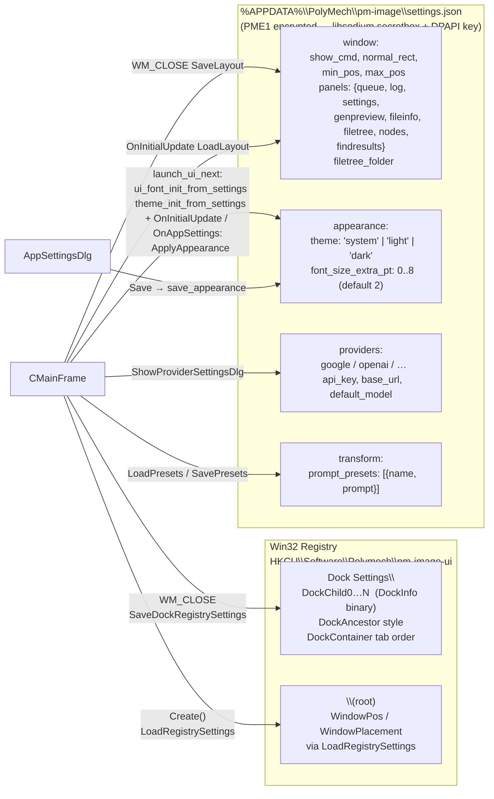

**`appearance` precedence**

- Loaded once at process start (before any window exists) by `pmui::ui_font_init_from_settings()` + `pmui::theme_init_from_settings()` so first-paint is correct.
- Re-evaluated automatically on `WM_SETTINGCHANGE("ImmersiveColorSet")` / `WM_SYSCOLORCHANGE` / `WM_THEMECHANGED` **only if `theme == "system"`**. Explicit `light` / `dark` choices are sticky across OS theme changes.
- Saved by `AppSettingsDlg → media::settings::save_appearance(...)`, which goes through the same load → merge → save pipeline as `save_window_layout` (preserves every other key in the JSON).
    