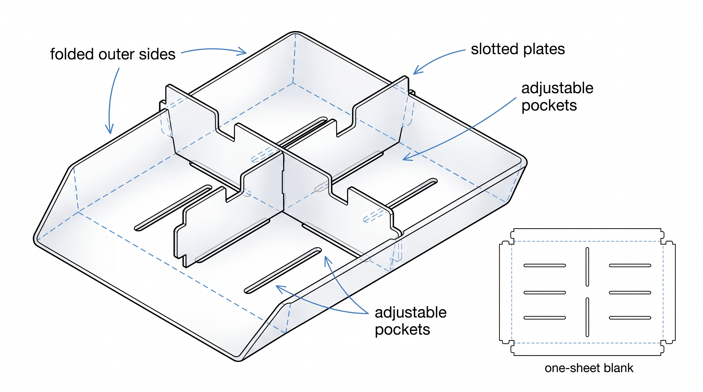
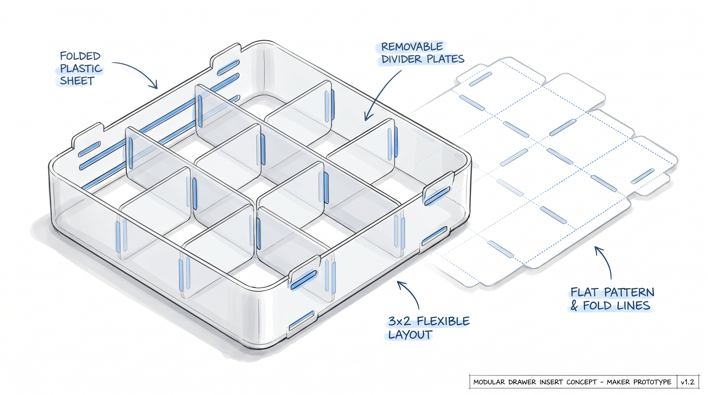

# Folded-Sheet Modular Drawer Organizer

A drawer insert concept built from **one plastic sheet**, folded along the outer edges and locked together with **slotted divider plates**. The goal is a low-part-count, easy-to-cut organizer that can be reconfigured into different pocket sizes without glue, screws, or permanent fixtures.



## Concept

The base starts as a flat plastic sheet with cut slots and scored fold lines. The outer perimeter folds upward to create the tray walls. Slotted plates then slide into the base and into one another, holding the structure square while dividing the drawer into pockets.

This makes the organizer:

- **Flat-packable** — cut from sheet stock and shipped or stored flat.
- **Tool-light** — ideal for laser-cut, CNC-routed, die-cut, or hand-prototyped plastic.
- **Reconfigurable** — plates can be moved or swapped for different pocket sizes.
- **Material-efficient** — the main body is a single folded sheet.
- **Repairable** — damaged divider plates can be replaced independently.

## Layout Variants

### 2 × 2 pocket layout

A compact layout for larger items or simple drawer organization. Two divider directions create four generous compartments while also bracing the folded outer walls.


### 3 × 2 pocket layout

A denser layout for smaller parts, tools, stationery, electronic components, fasteners, cosmetics, or kitchen-drawer items. Additional slotted plates create six pockets while keeping the same folded-sheet tray principle.



## Construction Principle

1. **Cut one plastic sheet** with perimeter profile, slots, and fold/score lines.
2. **Fold outer sides upward** to create the drawer tray walls.
3. **Insert slotted plates** through matching slots in the base and between plates.
4. **Lock the geometry** as the divider grid braces the sides and defines pocket sizes.
5. **Reconfigure pockets** by changing plate spacing, plate count, or slot positions.

## Design Notes

- Recommended materials: polypropylene, HDPE, PETG, thin ABS, or other flexible sheet plastics.
- Living hinges can be created by scoring, thinning, or heat-forming the fold lines.
- Slot width should match sheet thickness plus a small clearance allowance.
- Rounded slot ends reduce stress concentration and improve durability.
- Plate height can be lower than the outer wall for easier access, or equal height for stronger containment.
- Repeated slot rows allow adjustable divider placement.

## Possible Applications

- Workshop fastener drawers
- Electronics component bins
- Office stationery trays
- Kitchen utensil organization
- Cosmetics and bathroom storage
- Maker kits and modular packaging

## Next Prototype Targets

- Generate flat DXF/SVG cut patterns for 2×2 and 3×2 variants.
- Test slot tolerances for target sheet thicknesses.
- Add optional corner tabs or snap-lock features.
- Explore parametric pocket sizing for arbitrary drawer dimensions.


## Joinery and Bracket Options

The folded-sheet organizer can be strengthened or made more configurable with a small set of repeatable sheet-plastic joints. These options keep the concept compatible with flat cutting processes such as laser cutting, CNC routing, knife cutting, die cutting, or small-batch hand prototyping.

### 1. Tab-and-slot wall locks

Use integral tabs on the folded side walls that pass through matching slots in adjacent walls or base flanges.

- **Best use:** locking the tray corners and keeping folded walls square.
- **Recommended materials:** polypropylene (PP), polyethylene (PE), PETG; acrylic only for low-flex decorative prototypes.
- **Starting geometry:** tab length around `2 × sheet_thickness`.
- **Slot fit:** start with `sheet_thickness + 0.05 mm` for snug laser-cut parts, or `sheet_thickness + 0.15–0.25 mm` for easier hand assembly.
- **Detailing:** round tab roots and slot ends to reduce stress cracks.
- **Optional permanence:** PP/PE tabs can be heat-staked or ultrasonically welded after assembly if a non-removable frame is desired.

### 2. Fold-over corner brackets

Small L-shaped flaps can be cut as part of the one-piece sheet. After the wall folds up, each flap folds around the corner and snaps into a slot on the neighboring wall.

- **Best use:** reversible corner reinforcement without screws or glue.
- **Advantages:** still one-sheet, flat-packable, and tool-free.
- **Design note:** make the locking tab easy to reach from inside the tray so the drawer can be disassembled.
- **Bend note:** PP is preferred for repeated folding; PETG should use a larger radius or heat-assisted bend; acrylic should generally avoid fold-lock brackets unless the bend is pre-formed.

### 3. Slotted divider plates

Divider plates remain the main reconfigurable element. They can interlock with the base and each other using half-depth slots.

- **Best use:** adjustable pocket grids such as 2×2, 3×2, or mixed-width layouts.
- **Slot depth:** approximately `0.45–0.55 × divider_height` for crossing plates.
- **Base engagement:** shallow base slots or keyholes can keep dividers from drifting.
- **Clearance:** start with `slot_width = sheet_thickness + 0.1 mm`, then tune with a test coupon.
- **Access:** divider height can be lower than the perimeter walls so parts are easier to pick out.

### 4. Snap-fit divider retainers

For layouts that need to survive drawer vibration, add small cantilever hooks or arrow-head tabs at the bottom of each divider. These click into base slots and resist pull-out.

- **Best use:** removable but secure divider plates.
- **Recommended materials:** PP first, PETG second; avoid brittle acrylic snap hooks.
- **Hook lead-in:** use a shallow 15–30° lead-in angle for easy insertion.
- **Release:** include a finger notch or flexible release tab so the divider can be removed without tools.
- **Prototype caution:** snap fits are tolerance-sensitive; cut a small test strip before committing a full sheet.

### 5. Removable bracket clips

Instead of cutting all brackets into the main sheet, small separate U-, L-, or T-shaped clips can be cut from scrap material.

- **Best use:** strengthening high-load areas while keeping the main sheet simple.
- **Examples:** corner clips, wall-to-divider clips, divider intersection caps, anti-rattle wedges.
- **Advantage:** clips can be replaced or resized without changing the base pattern.
- **Trade-off:** adds extra parts, but still avoids metal fasteners.

### 6. Living-hinge folds

For a true one-sheet design, fold lines can act as living hinges or controlled bends.

- **Best material:** polypropylene sheet.
- **Usable materials:** PE and thin PETG for prototypes; acrylic is generally poor for repeated living hinges.
- **Manufacturing options:** scoring, thinning, creasing, heat bending, or dashed/perforated cuts.
- **Rule of thumb:** keep internal corners radiused and avoid sharp V-notches at the end of fold lines.
- **Practical target:** use the hinge only to fold the tray walls up once or a few times, not as a high-cycle moving hinge.

## Material and Tolerance Notes

| Material | Strengths | Cautions | Best joinery choices |
|---|---|---|---|
| **PP** | Excellent living hinges, tough snap fits, low friction | Can be harder to glue; laser cutting may need tuning | Living folds, snap tabs, fold-locks, divider slots |
| **PE / HDPE** | Tough, flexible, good chemical resistance | Lower stiffness; can feel waxy/slippery | Fold-locks, tabs, low-stress dividers |
| **PETG** | Clear, smooth, easier to cut than PP in many shops | Less fatigue-resistant than PP | Slotted dividers, tab-and-slot, light snap features |
| **Acrylic** | Rigid, precise laser-cut edges, visually clean | Brittle; poor for snap fits and living hinges | Static tab-and-slot, decorative prototypes, glued versions |
| **Corrugated plastic** | Light, cheap, easy to crease | Slots depend on flute direction; lower precision | Large drawer organizers, fold tabs, ultrasonic-welded or clipped joints |

Initial tolerance targets:

```text
snug_slot_width  = sheet_thickness + 0.05 mm
normal_slot_width = sheet_thickness + 0.10 mm
loose_slot_width = sheet_thickness + 0.20 mm
corner_tab_length = 2 * sheet_thickness to 4 * sheet_thickness
minimum_internal_radius = sheet_thickness where possible
```

Always tune these values with the actual stock and cutter. Kerf, melt-back, tool diameter, sheet thickness variation, and material springback often matter more than the nominal CAD dimensions.

## Recommended Prototype Path

1. **Cut a tolerance coupon** with slots from `t + 0.00 mm` through `t + 0.30 mm`.
2. **Test divider insertion** for both easy sliding and anti-rattle fit.
3. **Add fold-over corner tabs** to the one-sheet base pattern.
4. **Add optional snap hooks** only after the basic tab-and-slot version works.
5. **Keep bracket clips separate** for early prototypes so bracket geometry can change without recutting the full base.
6. **Document the winning clearances** directly in the parametric OpenSCAD file.

## Web Research References

- Tab-and-slot design research: <https://bostonscott.squarespace.com/s/Tab-Slot-Research-Paper.pdf>
- Laser cutting kerf overview: <https://www.fabworks.com/blog/laser-cutting-kerf-explained>
- Laser cutting tolerance notes: <https://kad3d.com.au/laser-cutting-tolerances/>
- Corrugated plastic joining methods: <https://polyflute.com/2023/04/27/how-to-join-corrugated-plastic-sheets/>
- Living hinge design guide: <https://www.fictiv.com/articles/how-to-design-living-hinges>
- Living hinge material/design overview: <https://jiga.io/articles/living-hinge-design/>
- Snap-fit component design: <https://www.fictiv.com/articles/how-to-design-snap-fit-components>
- Snap-fit design overview: <https://www.rapiddirect.com/blog/snap-fit-design/>
- Acrylic fabrication and bend guidance: <https://plaskolite.com/docs/default-source/fab/fab004_opx_extruded.pdf>


## Off-the-Shelf Hardware Options

The design should remain primarily **cut-and-fold sheet plastic**, but a small hardware kit can make early prototypes more robust, easier to assemble, or more suitable for production. These parts are easy to find from Amazon, McMaster-Carr, Digi-Key/Farnell-style component suppliers, AliExpress, hardware stores, plastics suppliers, and maker marketplaces.

### Recommended search terms

Use these terms when sourcing prototype hardware:

- `plastic corner brace`, `clear acrylic corner brace`, `ABS 90 degree bracket`
- `snap in panel clip`, `panel retainer clip`, `Tinnerman panel clip`
- `PVC U channel edge trim`, `edge protector U channel`, `Trim-Lok edge trim`
- `Chicago screws`, `sex bolts`, `binder posts`, `screw posts`
- `nylon machine screws`, `nylon washers`, `nylon nuts`
- `plastic push rivets`, `push in panel fastener`, `fir tree fastener`, `snap rivet`
- `rivet nut for plastic`, `Jacknut`, `Plusnut`, `blind rivet nut`
- `VHB tape`, `double sided acrylic foam tape`, `removable adhesive strips`
- `drawer divider clips`, `self stick divider holders`, `adjustable drawer divider hardware`
- `3D printable corner bracket`, `3D printed U channel`, `parametric drawer organizer connector`

### Hardware shortlist

| Hardware type | How it helps this drawer design | Typical sizing / material | Pros | Cautions |
|---|---|---|---|---|
| **Plastic / acrylic corner braces** | Reinforce folded tray corners from the inside. | Small ABS or clear acrylic L-brackets, often around 20–45 mm legs, using M3–M5 or #4–#8 screws. | Cheap, easy to source, visible proof-of-concept reinforcement. | Screw holes concentrate stress; avoid over-tightening brittle acrylic. Add soft washers if hardware contacts the drawer. |
| **Snap-in panel clips** | Retain folded side panels or removable divider ends without permanent glue. | Spring steel, stainless, or plastic clips selected by panel thickness and hole size. | Fast installation, some removable styles. | Must match hole diameter and sheet thickness closely; metal clips can scratch unless isolated. |
| **PVC U-channel / edge trim** | Covers exposed sheet edges, increases grip, and protects the drawer from sharp cut edges. | Flexible PVC or rubber edge trim, commonly sold for 1–4.5 mm edges or wider industrial ranges. | Very useful for user-facing edges; improves finish. | Adds thickness, so slot widths may need to increase where trim is used. |
| **Chicago screws / binder posts / sex bolts** | Reversible clamping for corners, folded overlaps, or divider anchor points. | Aluminum, brass, steel, stainless, or black oxide; common M4/M5 or imperial equivalents. | Clean low-profile appearance; removable and reusable. | Requires accurate hole alignment and correct post length for total stack thickness. |
| **Nylon screws, nuts, and washers** | Soft, drawer-safe fastening for light loads. | M3–M6 nylon machine screws and washers. | Low scratch risk, corrosion-free, easy to cut shorter. | Lower strength than metal; threads can strip if over-tightened. |
| **Plastic push rivets / snap rivets** | Quick blind fastening for light-duty clips, trim, or semi-permanent corner locks. | Nylon push rivets selected by hole diameter and total panel thickness. | Cheap, tool-light, good for fast prototypes. | Some are not reusable; hole size must match datasheet. |
| **Rivet nuts / Jacknuts / Plusnuts** | Add threaded anchors in thin plastic sheet or reinforced bracket zones. | M3–M6 inserts; selected by hole size and grip range. | Stronger threaded attachment than screws directly into plastic. | Needs installation tool; standard rivnuts can crush or crack brittle sheet. Use soft-material styles for plastics. |
| **Adhesive-backed mounts / VHB tape** | Attach small holders or anti-rattle pads without drilling. | Acrylic foam tape, VHB-style tape, removable adhesive strips. | No holes, low profile, useful for testing. | Bonding to PP/PE can be poor without primer; many tapes are semi-permanent. |
| **Drawer divider clips / self-stick holders** | Use existing commercial divider hardware to hold custom sheet dividers. | Acrylic divider holders, adhesive clips, galvanized drawer divider segments. | Fast validation of divider spacing and user experience. | May not match custom sheet thickness; adhesive holders can creep under load. |
| **3D-printed brackets / clips** | Custom clips can exactly match the folded-sheet geometry and slot pitch. | PETG, ABS, ASA, or PLA+; use heat-set inserts for repeated screw assembly. | Best for iteration; can become production reference geometry. | Printed parts need correct orientation and wall thickness; no certified load rating unless tested. |
| **Low-profile flush brackets** | Concealed or minimal reinforcement for premium versions. | Thin aluminum or steel flush-mount plates/brackets. | Clean aesthetic and compact packaging. | Many hidden hinge products expect thick wood panels, not 1–4 mm sheet plastic. |

### Suggested prototype hardware kits

#### Minimal all-plastic kit

Best when the design must stay lightweight and drawer-safe.

- PVC or rubber U-channel on the top wall edges.
- Nylon M3/M4 screws, nuts, and washers for experimental corner locks.
- Plastic push rivets for optional removable or semi-permanent retainers.
- Felt, silicone, or rubber feet on underside contact points.

#### Strong removable kit

Best for repeated assembly and test cycles.

- Chicago screws / binder posts for corner overlaps and divider anchors.
- Nylon or rubber washers under screw heads.
- Small clear acrylic or ABS corner braces inside each tray corner.
- Optional spring panel clips where dividers need snap-in retention.

#### Production-leaning kit

Best if the one-sheet geometry is validated and the hardware should become repeatable.

- Integral tab-and-slot geometry remains the primary lock.
- U-channel only on exposed/user-contact edges.
- Push rivets or snap clips only where the user needs tool-free replacement.
- Rivet nuts or brass heat-set inserts only in reinforced printed or molded accessories.
- Adhesive pads only for anti-rattle or drawer-protection surfaces, not primary structure.

### Integration notes for the parametric design

Add optional hardware parameters to the CAD model so the same flat pattern can generate **hardware-free**, **prototype**, and **reinforced** variants:

```text
use_corner_brace_holes = true / false
corner_screw_diameter  = 3.2 mm      // M3 clearance starter
binder_post_diameter   = 5.0 mm      // depends on selected post barrel
push_rivet_hole        = 3.2-6.0 mm  // from chosen datasheet
edge_trim_extra_width  = 0.8-2.0 mm  // extra slot allowance if U-channel is used
washer_diameter        = 8-12 mm
soft_pad_thickness     = 0.5-2.0 mm
```

For early prototypes, do not model a single fixed fastener family too soon. Instead, include small **test hole arrays** on scrap areas or a separate coupon:

```text
M3 clearance: 3.2, 3.4, 3.6 mm
M4 clearance: 4.2, 4.4, 4.6 mm
push rivet trial holes: 3.0, 3.2, 3.5, 4.0, 5.0, 6.0 mm
slot with edge trim: sheet_thickness + trim_wall + 0.2 mm
```

### Design cautions

- Prefer **soft or plastic-facing hardware** where parts may rub against finished drawer interiors.
- Use **felt/rubber pads** under metal brackets, screw heads, and protruding rivets.
- Avoid relying on adhesive tape as the only structural element for PP/PE unless the adhesive is specified for low-surface-energy plastics or used with primer.
- For acrylic, avoid snap hooks and high screw preload; use oversized clearance holes and washers.
- For PP/HDPE, mechanical capture usually works better than glue.
- For user-adjustable dividers, prioritize removable clips, binder posts, and slotted features over permanent rivets.
- Keep hardware heads below the divider top edge so items do not snag.
- Any metal fastener inside the tray should have smooth heads or caps to avoid damaging stored objects.

### Web research references for hardware

- Amazon ABS corner brace example: <https://amazon.com/MroMax-Plastic-Cabinet-Degree-Bracket/dp/B07W1X1QGP>
- U.S. Plastic clear acrylic corner brace: <https://usplastic.com/catalog/item.aspx?itemid=23840>
- McMaster-Carr corner brace angles: <https://www.mcmaster.com/products/corner-brace-angles/>
- McMaster-Carr plastic clips: <https://www.mcmaster.com/products/clips/material~plastic-1/>
- Tinnerman snap-fit / panel clip design data: <https://hweckhardt.com/images/pdf/data/Tinnerman-Snap-Fit-Design-Data.pdf>
- Trim-Lok edge trim / U-channel: <https://trimlok.com/plastic-extrusion/edge-trim/custom>
- Amazon uxcell PVC U-channel edge protector: <https://amazon.com/uxcell-Extrusion-Channel-Protector-Plastic/dp/B081JXC2T1>
- McMaster-Carr edging U-channels: <https://www.mcmaster.com/products/edging-u-channels/>
- Fastenright sex bolts / barrel nuts: <https://fastenright.com/products/general-fixings/sex-bolts-barrel-nuts>
- Strapwarehouse Chicago screws: <https://strapwarehouse.com/chicago-screws-stainless-steel-metric/>
- RivetnutUSA blind rivet catalog: <https://rivetnutusa.com/wp-content/uploads/2023/07/standard-blind-rivets-catalog-pages.pdf>
- RIVNUT / Plusnut / Jacknut reference: <https://rivetnutusa.com/wp-content/uploads/2018/11/RIVNUT-TheOriginalRivnut.pdf>
- Essentra panel fastener guide: <https://www.essentracomponents.com/en-us/news/solutions/fastening-components/a-guide-to-panel-fasteners>
- Essentra plastic rivet guide: <https://www.essentracomponents.com/en-us/news/solutions/fastening-components/how-to-choose-your-plastic-rivets-a-quick-guide>
- JetPress plastic panel fasteners: <https://jetpress.com/component-and-fastener-products/fasteners-and-components/panel-fasteners-plastic-rivets>
- 3M VHB tape selection overview: <https://strouse.com/blog/the-best-3m-vhb-tape-selection-guide>
- VHB alternatives overview: <https://engineeredmaterialsinc.com/articles/2021/12/9/3m-vhb-how-to-select-the-right-alternative-to-3m-vhb-4941-series-tapes>
- Command removable adhesive strips: <https://www.command.com/3M/en_US/p/pc/refill-strips/>
- DrawerDividerKit clear acrylic divider hardware: <https://drawerdividerkit.com/products/clear-acrylic-drawer-divider-kit>
- Lyon metal drawer divider segments: <https://lyonworkspace.com/product/metal-drawer-divider-for-modular-drawers/>
- Printables 90-degree bracket for 3 mm acrylic: <https://www.printables.com/model/423806-90-degree-corner-bracket-with-slot-for-3mm-acrylic>
- Hubs guide to heat-set inserts and threaded fasteners for 3D prints: <https://www.hubs.com/knowledge-base/how-assemble-3d-printed-parts-threaded-fasteners/>
- Rockler extra-thin flush mount bracket: <https://www.rockler.com/extra-thin-flush-mount-1-x-1>
