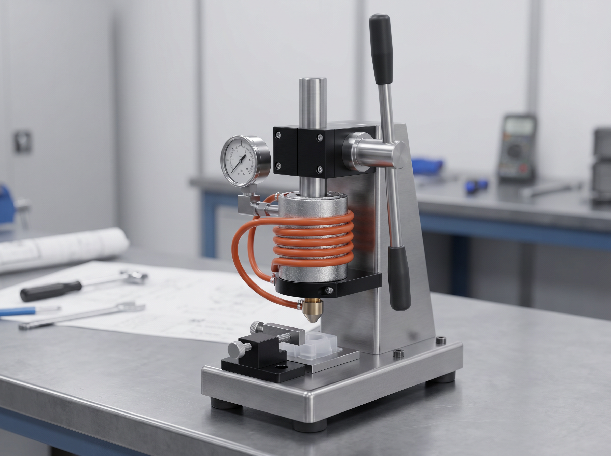

# Manual Plastic Arbor Injectors — Brief Summary

Manual plastic arbor injectors are small benchtop machines that melt thermoplastic and push it into a mold by hand. They suit prototypes, education, material trials, recycling tests, and small simple parts.

They work best with easy plastics like LDPE, HDPE, or PP, small parts, generous gates, short flow paths, good venting, strong clamping, PID temperature control, and consistent charge weights. Tougher materials need better drying, pressure, ventilation, and stronger parts.

Main design concerns are shot volume, heating, clamp strength, mold venting, and electrical safety. Key hazards include burns, spray, mold separation, crush injuries, fumes, shock, and fire.

Bottom line: low-cost and useful, but limited by mold design, material choice, process control, and safety.

## Myriad — Arbor Injection Machine Spec

Myriad is a heavier manual rack-and-pinion arbor-style plastic injection machine concept, aimed at higher-volume small-batch production than a compact benchtop injector while still avoiding pneumatics or hydraulics.

Reference specs found online for comparable arbour/arbor injection machines:

- **Machine type:** hand-powered rack-and-pinion injection moulder / arbor injection machine
- **Use case:** makerspaces, schools, home workshops, recycling labs, and small-batch production
- **Materials:** recycled HDPE, PP, LDPE, and PS are commonly listed for this class of machine
- **Shot size target:** about **155 g / 175 cm³** for a larger V2-style machine; smaller comparable machines list about **50 g per stroke**
- **Output rate:** around **1.12 kg/hr**, or up to **7 full cycles/hr** at maximum shot size, for the larger V2-style reference
- **Injection drive:** manual rack-and-pinion lever action; no compressor or air supply required
- **Injection pressure reference:** approximately **125 bar at the nozzle** for one V2-style design; another supplier lists **214 bar**
- **Heating:** dual heating zones with independent PID temperature controllers; common references list **2 × 300 W = 600 W total**, while another design lists **4 × 500 W band heaters**
- **Nozzle/barrel:** insulated heated barrel; one supplier lists a **3/4 in NPT nozzle**
- **Power:** broad reference range from **600 W heater power** to about **1.2 kW total machine power**, depending on design
- **Frame:** powder-coated steel or mild-steel rigid frame
- **Size/weight reference:** larger V2-style unit listed at about **160 × 22 × 40 cm** and **38.5 kg**; another supplier lists **830 × 800 × 1530 mm**
- **Mounting:** mandatory bolt-down installation using **M8 bolts** or equivalent rigid floor/bench mounting; not intended to operate freestanding
- **Mold system:** quick-release or positively clamped metal molds, generous gates, short flow paths, reliable vents, and adequate mold space; one V2-style design lists about **26 cm mould space**
- **Safety:** guarded barrel and moving parts, NVR/power-loss shutoff, heat shielding, grounded wiring, ventilation, eye/hand protection, and stable bolted mounting
- **Certification reference:** one commercial V2-style machine is listed as **CE and UKCA certified**

Design note: Myriad should be treated as a high-capacity manual injector baseline. Compared with Elena, prioritize larger shot volume, stronger bolt-down frame, guarded rack-and-pinion mechanism, dual-zone PID heating, quick mold changeover, and higher clamp/nozzle load capability.

Sources checked 2026-05-13:

- Sustainable Design Studio — Arbour Injection Machine V2: https://www.sustainabledesign.studio/arbour-injection-machine
- Sustainable Design Studio store listing — Arbour Press Injection Machine V2: https://www.sustainabledesign.studio/store/p/arbourinjection
- The Recreus Lab — Arbour Injection Machine: https://www.recreuslab.com/newyork/products/arbour-injection-machine/105

## Elena vs Myriad — Comparison Table

| Category | Elena | Myriad |
|---|---|---|
| Machine class | Compact benchtop manual arbor injector | Larger heavy-duty manual rack-and-pinion arbor injector |
| Best use | Prototypes, test coupons, education, recycling trials | Higher-volume small-batch work, makerspaces, schools, recycling labs |
| Target scale | Small parts and low-volume trials | Larger small parts and repeated production cycles |
| Preferred plastics | LDPE, HDPE, PP | Recycled HDPE, PP, LDPE, PS |
| Difficult plastics | PLA, ABS, nylon only with drying, ventilation, and better control | Possible only with stronger temperature control, drying, ventilation, and process discipline |
| Shot size | Sized to expected mold volume plus sprue/runner waste | Reference target about 155 g / 175 cm³; smaller comparable units about 50 g per stroke |
| Output rate | Low, operator-dependent | Reference up to about 1.12 kg/hr or 7 full cycles/hr at max shot size |
| Injection drive | Hand-lever arbor force | Manual rack-and-pinion lever action |
| Pressure capability | Limited; depends on press/frame/plunger geometry | Reference range about 125–214 bar at nozzle depending on design |
| Heating | Insulated heated barrel with PID and thermocouple | Dual-zone PID heating; references from 600 W to 1.2 kW+ total depending on design |
| Mold system | Simple clamped metal molds | Quick-release or positively clamped metal molds with larger mold space |
| Mounting | Stable benchtop/base required | Bolt-down mounting required, e.g. M8 bolts or equivalent |
| Frame | Compact rigid frame | Heavy powder-coated or mild-steel frame |
| Safety focus | Heat shielding, emergency cutoff, grounding, ventilation, PPE, pinch guards | Same as Elena plus guarded rack-and-pinion, stronger bolt-down stability, NVR/power-loss shutoff |
| Main advantages | Lower cost, smaller footprint, easier build, good for learning | Larger shot capacity, stronger mechanism, better for repeated small-batch production |
| Main limits | Low pressure, small shot size, repeatability, mold alignment | Larger, heavier, costlier, still manual and operator-dependent |
| Design priority | Simplicity, safety, small mold compatibility | Capacity, rigidity, guarded mechanism, dual-zone heating, quick mold changeover |

## Arbor Injector Image

